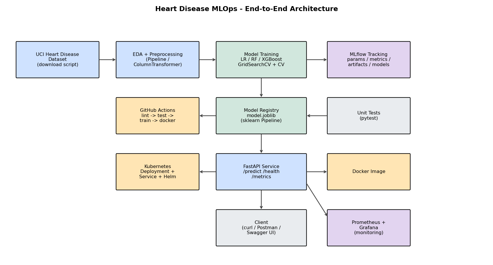

# Heart Disease Risk Prediction — End-to-End MLOps Pipeline

[](../../actions)

MLOps Assignment 01 — **AIMLCZG523 (Machine Learning Operations)**.
An end-to-end, reproducible ML system that predicts the risk of heart disease
from patient health data and serves it as a cloud-ready, monitored API.

> Dataset: **Heart Disease UCI** (Cleveland processed dataset, 303 records, 13
> features + binary target) from the UCI Machine Learning Repository.

---

## Architecture



Data acquisition → EDA & preprocessing (sklearn `Pipeline`/`ColumnTransformer`)
→ training of LR / RF / XGBoost with `GridSearchCV` + cross-validation → MLflow
experiment tracking → model packaging (`joblib`) → FastAPI service → Docker →
Kubernetes/Helm → Prometheus + Grafana monitoring. CI/CD via GitHub Actions.

## Repository layout

```
heart-disease-mlops/
├── src/heart_mlops/        # reusable package
│   ├── config.py           # paths, schema, constants
│   ├── data_download.py    # UCI download (+ offline fallback)
│   ├── preprocessing.py    # cleaning + ColumnTransformer + split
│   ├── eda.py              # EDA figures + summary
│   ├── train.py            # training, tuning, MLflow tracking
│   └── predict.py          # inference helpers
├── api/main.py             # FastAPI app (/predict, /health, /metrics)
├── notebooks/              # 01_eda, 02_training, 03_inference
├── tests/                  # pytest unit + integration tests
├── k8s/                    # Deployment, Service, Ingress
├── helm/heart-api/         # Helm chart
├── monitoring/             # Prometheus config + Grafana dashboard
├── .github/workflows/      # CI/CD pipeline
├── Dockerfile, docker-compose.yml
├── requirements.txt, requirements-dev.txt, pyproject.toml
└── reports/                # figures, EDA summary, final report
```

---

## 1. Setup (clean environment)

> **Where to run everything:** open PowerShell and `cd` into the **project root**
> (`D:\M Tech\MLops\Assignment\heart-disease-mlops`). Every command in this
> README — Python, tests, Docker, Compose and Kubernetes — is executed from that
> folder. Paths like `k8s/`, `./run_docker.ps1` and `./helm/heart-api` are
> relative to it.

```powershell
cd "D:\M Tech\MLops\Assignment\heart-disease-mlops"

# From the project root
python -m venv .venv
.\.venv\Scripts\Activate.ps1        # Windows
# source .venv/bin/activate         # Linux/macOS

pip install -r requirements.txt -r requirements-dev.txt
pip install -e .
```

## 2. Run the pipeline

```powershell
python -m heart_mlops.data_download   # download dataset -> data/raw/
python -m heart_mlops.eda             # EDA figures -> reports/figures/
python -m heart_mlops.train           # train + tune + MLflow, saves models/model.joblib
mlflow ui --port 5000                 # inspect experiments at http://localhost:5000
```

## 3. Tests, lint & format

```powershell
pytest                       # 14 unit + integration tests
flake8 src api tests
black --check src api tests
isort --check-only src api tests
```

## 4. Serve the API

```powershell
uvicorn api.main:app --host 0.0.0.0 --port 8000
# Swagger UI: http://localhost:8000/docs
```

Sample request:

```bash
curl -X POST http://localhost:8000/predict \
  -H "Content-Type: application/json" \
  -d @api/sample_input.json
# -> {"prediction":0,"label":"No Heart Disease","probability":0.1854,"confidence":0.8146}
```

## 5. Docker

> **Prerequisite:** Install and start **Docker Desktop** first (it provides
> `docker`, `docker compose`, and — after enabling it in *Settings → Kubernetes* —
> `kubectl`). Run all commands below from the project root. Start them **one at a
> time**: sections 5, 6 and 7 each use port 8000, so stop the previous one before
> starting the next. If PowerShell blocks the script, run once:
> `Set-ExecutionPolicy -Scope Process Bypass`.

```powershell
cd "D:\M Tech\MLops\Assignment\heart-disease-mlops"

# One command (builds, runs, smoke-tests /predict):
./run_docker.ps1
#   -> Swagger UI at http://localhost:8000/docs
#   stop it with:  docker rm -f heart-api

# or manually:
docker build -t heart-disease-api:latest .
docker run --rm -p 8000:8000 heart-disease-api:latest
```

## 6. Full stack (API + Prometheus + Grafana)

```powershell
cd "D:\M Tech\MLops\Assignment\heart-disease-mlops"
docker compose up --build
# API        -> http://localhost:8000/docs
# Prometheus -> http://localhost:9090
# Grafana    -> http://localhost:3000  (admin/admin)
# stop with Ctrl+C, then:  docker compose down
```

## 7. Kubernetes deployment

```powershell
cd "D:\M Tech\MLops\Assignment\heart-disease-mlops"

# Enable Kubernetes in Docker Desktop OR start minikube first.
# Build the image so the cluster can find it locally:
docker build -t heart-disease-api:latest .

kubectl apply -f k8s/
kubectl get pods,svc

# or with Helm (install once: winget install Helm.Helm):
helm install heart-api ./helm/heart-api
```

---

## Model results

Trained on the UCI Cleveland dataset (5-fold stratified CV, GridSearchCV):

| Model | Accuracy | Precision | Recall | F1 | ROC-AUC | CV ROC-AUC |
|-------|:-------:|:---------:|:------:|:---:|:-------:|:----------:|
| **Logistic Regression** ⭐ | 0.885 | 0.839 | 0.929 | 0.881 | **0.966** | 0.902 ± 0.014 |
| Random Forest | 0.885 | 0.839 | 0.929 | 0.881 | 0.955 | 0.898 ± 0.023 |
| XGBoost | 0.902 | 0.867 | 0.929 | 0.897 | 0.931 | 0.871 ± 0.021 |

**Selected model:** Logistic Regression (highest ROC-AUC). Persisted as a full
sklearn `Pipeline` (preprocessing + classifier) in `models/model.joblib`.

## API endpoints

| Method | Path | Description |
|--------|------|-------------|
| GET | `/` | Service metadata |
| GET | `/health` | Liveness/readiness probe |
| POST | `/predict` | Single prediction + confidence |
| POST | `/predict/batch` | Batch predictions |
| GET | `/metrics` | Prometheus metrics |
| GET | `/docs` | Swagger UI |

## Monitoring

- Structured request logging (method, path, status, latency) via middleware.
- Prometheus metrics at `/metrics` (`heart_predictions_total`,
  `heart_prediction_latency_seconds`, HTTP metrics).
- Grafana dashboard in `monitoring/grafana/heart-dashboard.json`.

## CI/CD

`.github/workflows/ci-cd.yml` runs on every push/PR:
`lint → test → train → docker`. The pipeline **fails on any lint or test error**
and uploads artifacts (coverage, trained model, MLflow runs).

---

## Reproducibility notes

- All dependencies pinned in `requirements.txt`.
- Preprocessing is embedded in the saved pipeline, so training and inference use
  identical transformations.
- `RANDOM_STATE = 42` fixes all splits and model seeds.
- If the UCI site is unreachable, `data_download.py` falls back to a deterministic
  synthetic dataset with the same schema so the pipeline still runs in CI.

## License / Academic integrity

Submitted as individual coursework for AIMLCZG523. See the assignment academic
integrity note.
